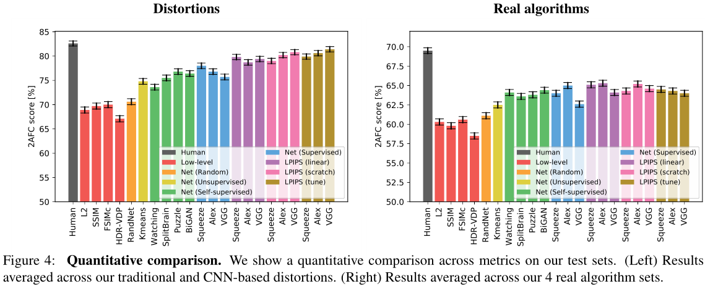
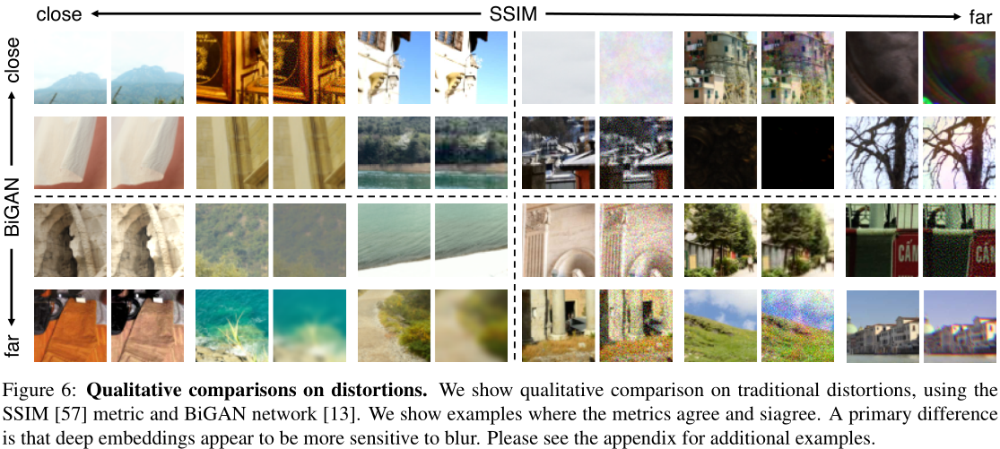

# Perceptual Similarity

> The Unreasonable Effectiveness of Deep Features as a Perceptual Metric.

- [Brief Introduction](#brief-introduction)
- [Main contributions](#main-contributions)
- [Methodology](#methodology)
  - [The perceptual similarity dataset](#the-perceptual-similarity-dataset)
  - [Similarity measures](#similarity-measures)
- [Deep Feature Spaces](#deep-feature-spaces)
  - [Network activations to distance](#network-activations-to-distance)
  - [Training on this data](#training-on-this-data)
- [Experiments](#experiments)
  - [Performance of low-level metrics and classification networks](#performance-of-low-level-metrics-and-classification-networks)
  - [Metrics correlate across different perceptual tasks](#metrics-correlate-across-different-perceptual-tasks)
  - [Where do deep metrics and low-level metrics disagree?](#where-do-deep-metrics-and-low-level-metrics-disagree)
- [Conclusions](#conclusions)
- [Referred in](#referred-in)

:::tip 🌏 Source
Downloadable at: [Open Access - CVPR 2018](https://openaccess.thecvf.com/content_cvpr_2018/papers/Zhang_The_Unreasonable_Effectiveness_CVPR_2018_paper.pdf). Source code is available at: [GitHub - richzhang/PerceptualSimilarity](https://github.com/richzhang/PerceptualSimilarity).
:::

## Brief Introduction

The paper argues that widely used image quality metrics like SSIM and PSNR mentioned in [[image-quality-assessment]] are _simple and shallow_ functions that may fail to account for many nuances of human perception. The paper introduces a new dataset of human perceptual similarity judgments to systematically evaluate deep features across different architectures and tasks and compare them with classic metrics.

Findings of this paper suggests that _perceptual similarity is an emergent property shared across deep visual representations._

## Main contributions

In this paper, the author provides a hypothesis that perceptual similarity is not a special function all of its own, but rather a _consequence_ of visual representations tuned to be predictive about important structure in the world.

- To testify this theory, the paper introduces a large scale, highly varied perceptual similarity dataset containing 484k human judgments.
- The paper shows that deep features trained on supervised, self-supervised, and unsupervised objectives alike, model low-level perceptual similarity surprisingly well, outperforming previous, widely-used metrics.
- The paper also demonstrates that network architecture alone doesn't account for the performance: untrained networks achieve much lower performance.

The paper suggests that with this data, we can improve performance by _calibrating_ feature responses from a pre-trained network.

## Methodology

### The perceptual similarity dataset

> This content is less related to my interests. I'll cover them briefly.

- Traditional distortions: photometric distortions, random noise, blurring, spatial shifts, corruptions.
- CNN-based distortions: input corruptions (white noise, color removal, downsampling), generator networks, discriminators, loss/learning.
- Distorted image patches.
- Superresolution.
- Frame interpolation.
- Video deblurring.
- Colorization.

### Similarity measures

- 2AFC similarity judgments: [[2afc]] - Two-alternative forced choice.
- Just noticeable differences: [[jnd]]

## Deep Feature Spaces

### Network activations to distance

The distance between reference and distorted patches $x$ and $x_0$ is calculated using this workflow and the equation below with a network $\mathcal{F}$. The paper extract feature stack from L layers and unit-normalize in the channel dimension. Then the paper scales the activations channel-wise and computes the $\ell_2$ distance.

$$d(x,x_0)=\sum_l\frac{1}{H_lW_l}\sum_{h,w}\|w_l\odot(\hat{y}^l_{hw}-\hat{y}^l_{0hw})\|_2^2$$

### Training on this data

The paper considers the following variants:

- **_lin_**: the paper keep pre-trained network weights fixed and learn linear weights $w$ on top.
- **_tune_**: the paper initializes from a pre-trained classification model and allow all the weights for network $\mathcal{F}$ to be fine-tuned.
- **_scratch_**: the paper initializes the network from random Gaussian weights and train it entirely on the author's judgments.

Finally, the paper refer to these as variants of the proposed **Learned Perceptual Image Patch Similarity (LPIPS)**.

## Experiments

### Performance of low-level metrics and classification networks

Figure 4 shows the performance of various low-level metrics (in red), deep networks, and human ceiling (in black).

### Metrics correlate across different perceptual tasks

The 2AFC distortion preference test has high correlation to JND: $\rho = .928$ when averaging the results across distortion types. This indicates that 2AFC generalizes to another perceptual test and is giving us signal regarding human judgments.

### Where do deep metrics and low-level metrics disagree?

Pairs which BiGAN perceives to be far but SSIM to be close generally contain some blur. BiGAN tends to perceive correlated noise patterns to be a smaller distortion than SSIM.

## Conclusions

The stronger a feature set is at classification and detection, the stronger it is as a model of perceptual similarity judgments.

Features that are good at **semantic tasks**, are also good at **self-supervised and unsupervised tasks**, and also provide **good models of both human perceptual behavior and macaque neural activity.**

:::backlinks
## Referred in
* [[papers]]
	* | Paper Title               | Publication | Source Code                                                                         |
| [[perceptual-similarity]] | CVPR 2018   | [richzhang/PerceptualSimilarity](https://github.com/richzhang/PerceptualSimilarity) |
:::

[//begin]: # 'Autogenerated link references for markdown compatibility'
[image-quality-assessment]: image-quality-assessment.md 'Image Quality Assessment'
[2afc]: 2afc.md 'Two-alternative forced choice'
[jnd]: jnd.md 'Just-noticeable difference'
[papers]: papers.md 'Papers'
[perceptual-similarity]: perceptual-similarity.md 'Perceptual Similarity'
[//end]: # 'Autogenerated link references'
